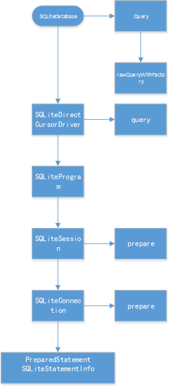

# 数据库查询优化
## 背景
1. 有一个3万多条数据的账本，一次性全部查询取出，查询时间非常长<br/>

账本|数据条数|账本大小|手机|内存|CPU|查询时间
---|---|---|---|---|---|---
家庭账本|36000+|1M+|米 Note4X|3GB|高通 骁龙625|38S+（平均）

2. 从数据库查询出数据后，重新组装也非常耗时：<br/>

账本|数据条数|账本大小|手机|内存|CPU|查询时间
---|---|---|---|---|---|---
家庭账本|36000+|11M+|红米 Note4X|3GB|高通 骁龙625|15S+（平均）

## 优化方案
关于数据库优化方法，网上有很多相关资料，也有很多具体的思路和实践，这里就不再展开说明优化的手段。这里就不再逐一介绍，这篇文章主要是分析数据库的性能瓶颈，从而解决数据库查询速度过慢问题。
## 性能瓶颈分析
首先要了解性能的瓶颈是什么，即先定位查询这么久的原因是什么。<br/>
经过调试发现，执行了查询语句后，等待查询结果与解析查询结果并返回，这两部分花费了大量的时间。<br/>
进一步发现，尽管我们的查询语句非常复杂，但是查询的时间瞬间就完成，所有的时间都花费在了从 Cursor 中读取数据。<br/>
在LogCat 中的也发现了一些日志：<br/>

```
W/CursorWindow: Window is full: requested allocation 324 bytes, free space 
81 bytes, window size 2097152 bytes
```

大概的意思是内存不足，很可能这个就是造成性能瓶颈的主要原因。要想了解这个是什么意思，怎么解决，我们先分析一下数据库的加载流程。<br/>

## 数据库执行分析
我们都知道，执行语句交给了 SqliteDatabase，那它是怎么执行的呢？<br/>


从上图可以看出，数据库执行了 sql 语句，只是构造了查询信息，进行了一系列的准备。我们以 query 方法为例，查看它的调用过程：

1. 从 SqliteDatabase 出发，query() 最终调用它的 rawQueryWithFactory() 方法:

```java
public Cursor rawQueryWithFactory(CursorFactory cursorFactory,String sql,String[] selectionArgs,String editTable,CancellationSignal cancellationSignal){
        	acquireReference();
        	try{
        		SQLiteCursorDriver driver=new SQLiteDirectCursorDriver(this,sql,editTable,cancellationSignal);
        		return driver.query(cursorFactory!=null?cursorFactory: mCursorFactory,selectionArgs);
        	}finally{
        		releaseReference();
        	}
}
```

2. 从上面的代码片段看到，在 rawQueryWithFactory() 方法的内部，构造出了一个叫 SQLiteDirectCursorDriver 的类，并且调用了该类的 query() 方法，我们跟踪到它的 query() 方法中：

```java
public Cursor query(CursorFactory factory, String[] selectionArgs) {
     final SQLiteQuery query = new SQLiteQuery(mDatabase, mSql, mCancellationSignal);
     final Cursor cursor;
     try {
     	query.bindAllArgsAsStrings(selectionArgs);
     	if (factory == null) {
     		cursor = new SQLiteCursor(this, mEditTable, query);
     	} else {
     		cursor = factory.newCursor(mDatabase, this, mEditTable, query);
     	}
     } catch (RuntimeException ex) {
     	query.close();
     	throw ex;
     }
     mQuery = query;
     return cursor;
}
```

3. 可以看到，SQLiteDirectCursorDriver.query() 最终会构建一个 Cursor，这个 Cursor 我们都很熟悉，从数据中得到查询结果，都要通过这个类。<br/>
Cursor 可以通过传入的 CursorFactory 构建，如果传入的 factory 为null，则会构建一个 SqLiteCursor。CursorFactory 是在 new 一个 SqliteDatabase 对象的时候传入的，类似于自定义一个 SQLiteCursor：

```java
    private SQLiteDatabase(final String path, final int openFlags,
    CursorFactory cursorFactory, DatabaseErrorHandler errorHandler,
     int lookasideSlotSize, int lookasideSlotCount, long idleConnectionTimeoutMs){.....}
```

因为自定义一个Cursor 较为复杂，看 SqliteCursor 的实现就可知（后面分析），所以一般都传入 null，即不自定义 Cursor，使用系统自带的 SqLiteCursor。

4. 到了这一步，query()的方法就已经结束，系统只是帮我们构建了一个 SqLiteCursor，但并没有执行什么。

## SqLiteCursor – 真正的执行者
从上面的 SqliteDatabase 的 query()查询方法源码分析中，执行 query()方法本身并不消耗多少内存和时间，那真正需要消耗性能的地方在哪呢？<br/>
从 Cursor 中读取数据的方式一般为：

```java
    while (cursor.moveToNext()) {
	     list.add(cursor.getLong(cursor.getColumnIndex("accountId")));
    }
```

Cursor 的用法大家都比较熟悉，这里就不详细介绍，它与迭代器Iterator 非常类似，我们可以对 Cursor 进行迭代，取出我们想要的值。<br/>
而每次迭代，都会执行一次 move 操作，无轮是 moveFirst()，还是moveNext() 等等的 move 系列方法，其内部都是调用 onMove() 方法进行操作的，我们看看 onMove() 方法：

```java
    @Override
    public boolean onMove(int oldPosition, int newPosition) {
     // Make sure the row at newPosition is present in the window
     if (mWindow == null || newPosition < mWindow.getStartPosition() ||
     newPosition >= (mWindow.getStartPosition() + mWindow.getNumRows())) {
     	fillWindow(newPosition);
     	}
     return true;
	}
```

SqliteCursor 的 move() 方法，判断 Window 为null，或超出 Window 的范围，变会调用 fillWindow()方法：

```java
    private void fillWindow(int requiredPos) {
     clearOrCreateWindow(getDatabase().getPath());
     ......
    }
```

fillWindow() WindowSqliteCursor CursorWindow : 

```java
 protected void clearOrCreateWindow(String name) {
     	if (mWindow == null) {
     		mWindow = new CursorWindow(name);
     	} else {
    	 	mWindow.clear();
     	}
    }
```

CursorWindow 创建了一个默认2M 大小的WindowSize，具体实现在 c 层。当查询数据过大时，便会导致内存不足，或超出 Window 的范围，此时便会频繁创建 CursorWindow，导致卡顿, 详细代码可见：CursorWindow C 实现，C 层的 CursorWindow <br/>
其中 C 层的 CursorWindow 中的 alloc() 方法，当内存不足时，便会打印文章开头提到的 Log 日志。

## 解决方法

### ~~修改默认的 CursorWindow 大小~~

通过在 APP 启动时，反射修改 CursorWindow 的默认大小，将 2M 修改为 20M：
```java
static private void setCursorWindowSize(int size){
   if (Build.VERSION.SDK_INT >= Build.VERSION_CODES.ICE_CREAM_SANDWICH) {
       try {
           final Class cls = Class.forName("android.database. CursorWindow");
           final Field fld = cls.getDeclaredField("sCursorWindowSize");
           fld.setAccessible(true);
           int before = fld.getInt(null); // default=2048*1024
           fld.setInt(null, size * 1024); // extend to
           int after = fld.getInt(null);
           Log.d(TAG, "sCursorWindowSize:" + before + "/" + after);
       } catch (Exception e) {
           Log.e(TAG, e);
       }
   }
}
```

运行发现，LogCat 不再提示内存不足，查询速度也从38s+ 减少到 34+，但因为项目的数据库是一个账本一个，当有许多账本的时候，可能会引起内存泄露，故没有采取这个方案。

账本|数据|账本大小|手机|内存|CPU|查询时间
---|---|---|---|---|---|---
家庭账本|36000+|11M+|红米 Note4X|3GB|高通 骁龙625|34S+（平均）

### 检查查询字段,缓存部分查询
前文分析说明，关键是要检查查询结果的大小，查询结果越小，则速度越快。<br/>
查询字段关联了数据表很多字段，同时还关联了“项目，成员，商家，账户，分类”等各种业务的表，非常复杂。因此，先将数据表本身不必要的字段剔除，同时将其他表所有非必要字段全部剔除，使用缓存方式，一次性将其他关联表数据查询出来，再在Java内存中组装，一共去掉了19个无用字段，查询速度从38s+骤减到16s+ :

账本|数据条数|账本大小|手机|内存|CPU|查询时间
---|---|---|---|---|---|---
家庭账本|36000+|11M+|红米 Note4X|3GB|高通 骁龙625|16S+（平均）

缓存功能同样适用于问题2，超级流水数据完全查询出到内存中后，切换选项卡，并不会从数据库重新查询数据，切换年/月速度慢，原因是在查询在组装年月数据的时候，会查询年或月的开始时间，每组装一条数据便查询一次，这个查询也可以缓存起来：

```java
public static SuperTransWrapper getTransByTimeYear(List<TransactionVo>
  transList, long accountId, boolean isCompositeAccount) {
    ......
    int count = transList.size();
    if (count > 0) {
        for (int i = 0; i < count; i++) {
        String yearStr = getTransYear(transactionVo.getTradeTime());
        }
    }
    ......
    return superTransWrapper;
}
```

将 String yearStr = getTransYear(transactionVo.getTradeTime()); 提取到for 循环外面缓存,再切换年月：

账本|数据条数|账本大小|手机|内存|CPU|执行时间
---|---|---|---|---|---|---
家庭账本|36000+|11M+|红米 Note4X|3GB|高通 骁龙625|几十毫秒

### 项目数据库框架本身优化
项目的数据库查询，对结果 Cursor 进行了一份拷贝（自定义了 MyCursor）,这样将占用 CursorWindow 的内存，拷贝的过程也浪费时间，在普通查询情况下，该拷贝影响不大，在数据量巨大的情况下影响就非常大了，在超级流水的查询中，将该拷贝去掉，直接从原始的 Cursor 中获取数据：

账本|数据条数|账本大小|手机|内存|CPU|查询时间
---|---|---|---|---|---|---
家庭账本|36000+|11M+|红米 Note4X|3GB|高通 骁龙625|7S+

可以看到，去掉了拷贝 Cursor，速度快了一倍。

## 总结
经过优化后，查询时间最终从38s+ 降低到了7S+ ，速度提升88% 。查询本身能优化的点非常多，需要先分析其真正的瓶颈在哪，再着手优化，就能游刃有余。

## 参考资料
https://ahangchen.gitbooks.io/windy-afternoon/content/android/sqlite/%E4%BB%8E%E6%BA%90%E7%A0%81%E7%9C%8BANDROID%E4%B8%ADSQLITE%E6%98%AF%E6%80%8E%E4%B9%88%E9%80%9A%E8%BF%87CURSORWINDOW%E8%AF%BBDB%E7%9A%84.html

https://zhuanlan.zhihu.com/p/32110862

https://android.googlesource.com/platform/frameworks/base/+/master/core/jni/android_database_CursorWindow.cpp  
