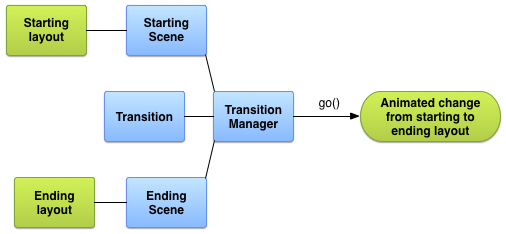
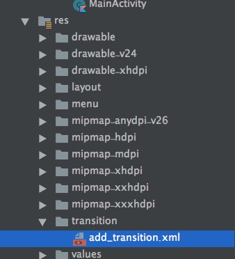
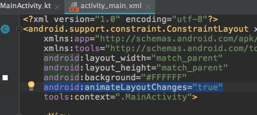
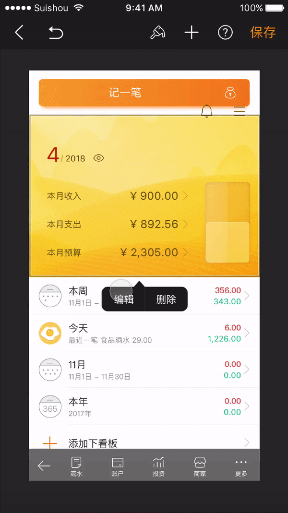
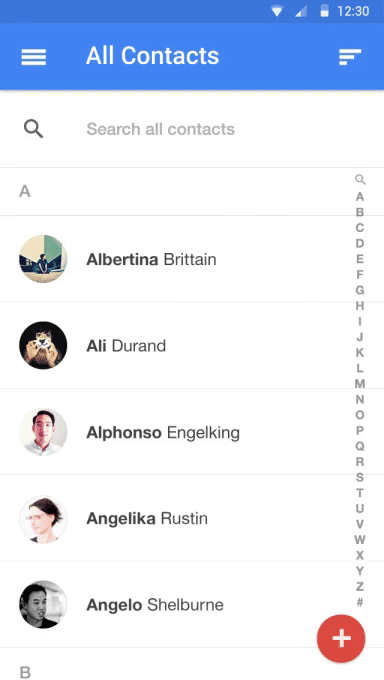
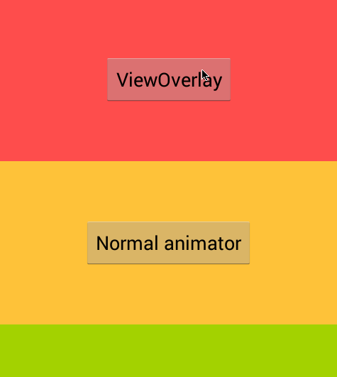
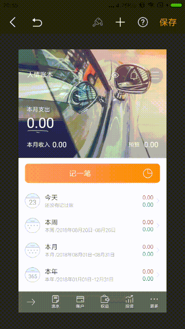

# Transition Framework 转场动画框架

Android 动画分三种，分别为补间动画，帧动画，以及属性动画，关于这三种动画的介绍网上有很多资料，这里就不再详细介绍。<br/>
Transition 是 API 19,即 Android 4.4 版本新加入的类。<br/>不过它的许多功能在 API 21(Android 5.0)后才具体的实现。根据 Transition API 的定义：<b>Transition 包含了一个场景（Scene）更换所需要的动画信息。</b>
这句话有表达了两个比较重要的信息：

1. 场景：Scene，什么是场景？如何定义一个场景？<br/>
2. Transition 框架是如何包含了动画信息的，又是怎么样执行的呢？

下文将会为红领巾们解答这两个疑惑，解开 Transition 的神秘面纱。

## 简单使用
转场动画使用的场景非常多，下面主要通过两个例子来简单介绍一下转场动画的使用：布局改变与Activity 共享元素动画。
### 布局改变时使用转场动画
转场动画的使用比较简单，只需要三个步骤即可。<br/>

1. 创建开始和结束的场景 Scene
2. 创建 Transition
3. 启动 Transition

流程如下文图所示：<br/>


开始场景，即当前用户所见，下一刻即将变化的 UI 快照，所以往往并不需要创建开始场景。<br/>
结束场景，即变化结束后，想要呈现给用户看的 UI。 <br/>
场景在 Android 中表现为 view，创建一个场景，实际上就是创建一个 View,这个 View 被 Scene 修饰封装了一下而已：

```kotlin
//创建一个 Scene，view 可以从 layout 布局中解析，也可以使用代码动态创建
//img_sence 有两个 TextView，比较简单，这里就不贴出代码了
val scene = Scene.getSceneForLayout(flContent, R.layout.img_sence, this)
```

创建 Transition，包含动画信息。<br/>
在 res 资源目录下创建 transition 目录，用于保存 transition 文件，并创建 add_transition.xml 文件：<br/>


内容如下：<br/>

```xml
<autoTransition xmlns:android="http://schemas.android.com/apk/res/android" />
```

这表示创建一个自动转场效果的转场动画，代码中解析该布局并创建 Transition：

```kotlin
//解析布局，创建 Transition
val mFadeTransition = TransitionInflater.from(this).inflateTransition(R.transition.add_transition)
```

最后，我们启动这个 Transition:

```kotlin
TransitionManager.go(scene, mFadeTransition)
```

实际上完整的代码就三行：

```kotlin
tvAdd.setOnClickListener {
    //创建一个 Scene，view 可以从 layout 布局中解析，也可以使用代码动态创建
    val scene = Scene.getSceneForLayout(flContent, R.layout.img_sence, this)
    //解析布局，创建 Transition
    val mFadeTransition = TransitionInflater.from(this)
            .inflateTransition(R.transition.add_transition)
    //启动转场动画
    TransitionManager.go(scene, mFadeTransition)
}
```

<br/>让我们看看动画效果：<br/>


### 各种转场动画

很明显转场动画最重要的是转场动画的类型，上面的例子我们创建的是一个自动转场动画，Transition 框架还提供了很多其他转场动画：

动画类型|描述
---|---
ChangeBounds|Layout布局改变
ChangeClipBounds|Clip 变化
ChangeImageTransform|图片变幻
ChangeScroll|滚动
ChangeTransform|布局动画：旋转，缩放等
Visibility|显示和隐藏
AutoTransition|自动变化
Explode|移入移出
Fade|淡入淡出
Slide|滑入滑出

<br/>下面是使用 Explode 转场动画的效果：<br/>


除了系统提供的转场动画，也可以自定义转场动画，只要继承 Transition，并实现对应的方法即可。

### 默认动画效果 
在开发首页自定义时，有同学对比了iOS 发现动效特别好，而Android的 view 的变化却非常生硬而且没有动效。实际上在 Android 上要设置默认的动画效果，三行代码都不需要，只要一句话即可，在xml 中使用转场动画：<br/>


只要 layout 变化时，便会自动调用转场动画。不过设计需要的动画效果都是按照 iOS 的动画效果要求的，所以 Android 自带的转场动画并没有什么用。<br/>


### Activity 共享元素动画
讲共享元素之前，先看看设计发的一个动画效果：<br/>


这个动效要求在两个 Activity 之间做动画，当时有少先队员提议改成碎片，有红领巾提议使用Activity 的共享元素动画。改成两个 Fragment 之间做动画效果，无疑是比较容易的，动画效果好实现，但自定义首页的代码结构，不好用碎片实现。<br/>
使用共享元素做动画，也可以实现这个效果,例如 A 启动 B，A 中这么设置：<br/> 

```
        // inside your activity (if you did not enable transitions in your theme)
        with(window) {
            requestFeature(Window.FEATURE_CONTENT_TRANSITIONS)
        }
        setContentView(R.layout.activity_main4)
        redContainer.setOnClickListener {

            val intent = Intent(this, Main4Activity::class.java)
            // create the transition animation - the images in the layouts
            val options = ActivityOptions.makeSceneTransitionAnimation(this,
                    Pair.create(view1, "agreedName1"),
                    Pair.create(view2, "agreedName2"))
            // start the new activity
            startActivity(intent, options.toBundle())
        }
```


同时，在 B Activity 中设置，即可实现共享元素动画：

```kotlin
        ViewCompat.setTransitionName(view1,"agreedName1")
        ViewCompat.setTransitionName(view2,"agreedName2")
```

<br/>效果如下图所示：<br/>



共享元素动画可以实现开头中视频所提效果，但该动画只支持5.0及以上的 API。<br/>开头我们已经提到了，转场动画本身是4.4加入的，而共享元素用到的一个转场动画效果，在5.0之后才实现了，所以目前共享元素动画支持5.0及以上的手机。<br/>
而随手记目前最低支持4.0版本的手机，所以设计的效果我们无法满足。难道就没有办法了吗？<br/>
当然不是，欲知怎么解决，且听下文分析。


## 原理
了解了转场动画的大概使用，相信大家就会有疑问，转场动画框架这么牛逼，这么简单，它是怎么执行的，原理是什么，它是不是一种新的动画？<br/>
实际上转场动画并不是一种新的动画，文章开头已经交代了，转场动画的定义是：<b>一个包含了场景动画的框架。</b><br/>
也就说它本身并不是动画的执行者，它只是包含了动画的一些信息，而真正的执行者是属性动画做的。<br/>

回到我们之前说的，实现转场动画一共就三个步骤：

1. 创建开始和结束的场景 Scene
2. 创建 Transition
3. 启动 Transition

### Scene
Scene 看其源码非常简单，不到200行代码，主要是持有了 ViewGroup，View 用于场景布置，
本身并没有特别复杂的东西。

### Transition
Transition 是转场动画的核心，里面承载了 UI 的动画信息,观察其源码，可以发现大量的 list，用于存储 view 的信息，以及动画的信息。<br/>

```java
    ArrayList<Integer> mTargetIds = new ArrayList<Integer>();
    ArrayList<View> mTargets = new ArrayList<View>();
    ArrayList<String> mTargetNames = null;
    ArrayList<Class> mTargetTypes = null;
    ArrayList<Integer> mTargetIdExcludes = null;
    ArrayList<View> mTargetExcludes = null;
    ArrayList<Class> mTargetTypeExcludes = null;
    ArrayList<String> mTargetNameExcludes = null;
    ArrayList<Integer> mTargetIdChildExcludes = null;
    ArrayList<View> mTargetChildExcludes = null;
    ArrayList<Class> mTargetTypeChildExcludes = null;
    private TransitionValuesMaps mStartValues = new TransitionValuesMaps();
    private TransitionValuesMaps mEndValues = new TransitionValuesMaps();
    TransitionSet mParent = null;
    int[] mMatchOrder = DEFAULT_MATCH_ORDER;
    ArrayList<TransitionValues> mStartValuesList; // only valid after playTransition starts
    ArrayList<TransitionValues> mEndValuesList; // only valid after playTransitions starts
```

Transition 的实现类，以 ChangeBounds 为例，关键代码是实现了 Transition 的 createAnimator()，该方法根据 Transition 保存的 View 的信息，与动画信息，来执行相应的动画。<br/>

```java
    public Animator createAnimator(final ViewGroup sceneRoot, TransitionValues startValues,
            TransitionValues endValues)
```


看其关键代码，就是使用属性动画实现了转场动画 ChangeBounds 的效果：<br/>

```java
......

final ViewBounds viewBounds = new ViewBounds(view);
Path topLeftPath = getPathMotion().getPath(startLeft, startTop,
        endLeft, endTop);
ObjectAnimator topLeftAnimator = ObjectAnimator
        .ofObject(viewBounds, TOP_LEFT_PROPERTY, null, topLeftPath);
Path bottomRightPath = getPathMotion().getPath(startRight, startBottom,
        endRight, endBottom);
ObjectAnimator bottomRightAnimator = ObjectAnimator.ofObject(viewBounds,
        BOTTOM_RIGHT_PROPERTY, null, bottomRightPath);
AnimatorSet set = new AnimatorSet();
set.playTogether(topLeftAnimator, bottomRightAnimator);
anim = set;
set.addListener(new AnimatorListenerAdapter() {
    // We need a strong reference to viewBounds until the
    // animator ends.
    private ViewBounds mViewBounds = viewBounds;
});

......
```

### TransitionManager
TransitionManager 源码也非常少，关键是调用TransitionManager.go()方法时，最终会执行 Transition 的 playTransition() 方法，也就是说，最终启动动画的还是 Transition 本身，而 playTransition() 最终调用了自身的 Transition.animate() 方法，从而启动了属性动画。

```java
    /**
     * This is a utility method used by subclasses to handle standard parts of
     * setting up and running an Animator: it sets the {@link #getDuration()
     * duration} and the {@link #getStartDelay() startDelay}, starts the
     * animation, and, when the animator ends, calls {@link #end()}.
     *
     * @param animator The Animator to be run during this transition.
     *
     * @hide
     */
    protected void animate(Animator animator) {
        // TODO: maybe pass auto-end as a boolean parameter?
        if (animator == null) {
            end();
        } else {
            if (getDuration() >= 0) {
                animator.setDuration(getDuration());
            }
            if (getStartDelay() >= 0) {
                animator.setStartDelay(getStartDelay() + animator.getStartDelay());
            }
            if (getInterpolator() != null) {
                animator.setInterpolator(getInterpolator());
            }
            animator.addListener(new AnimatorListenerAdapter() {
                @Override
                public void onAnimationEnd(Animator animation) {
                    end();
                    animation.removeListener(this);
                }
            });
            animator.start();
        }
    }
```


也就是说整个转场动画的过程是：

1. 场景（Scene）设置需要执行动画的 UI
2. Transition 存储 View 与动画的信息
3. Transition 的子类（实现类）实现具体的动画应该怎么执行
4. 最后 TransitionManager 调用 Transition 的动画执行方法，转场动画就跑起来了。

回看之前官方文档给出的转场动画流程图，符合源码分析：


### ViewOverlay 辅助类
我们都知道，动画执行有一个问题：当一个 View 执行动画时，只能在 View 所在的 ViewGroup 中执行，如果位移到了ViewGroup之外，我们是看不到动画效果的。<br/>
仔细观察上面的共享元素效果，个人头像所在的 ViewGroup 很可能只是上面那个大的矩形，但是却能做到从屏幕底下一下到上面的效果，突破了所在的 ViewGroup 的限制。<br/>


实际上是因为共享元素动画依赖 ViewOverlay 来实现了这个效果。ViewOverlay 是 API 18 添加的一个辅助类，当调用 View.getOverlay()方法时，会自动创建一个铺满整个屏幕的，透明的 ViewGroup。<br/>
ViewOverlay 本身并不是一个 ViewGroup，但它持有一个叫 OverlayViewGroup 的 ViewGroup，这个 ViewGroup 本身不接受任何点击触摸事件，透明无形，只做绘制功能。<br/>

举个简单的例子：<br/>




我们看一下它的布局文件：<br/>

```xml
<LinearLayout xmlns:android="http://schemas.android.com/apk/res/android"
    xmlns:tools="http://schemas.android.com/tools"
    android:layout_width="match_parent"
    android:layout_height="match_parent"
    android:orientation="vertical"
    tools:context=".MainActivity" >

    <FrameLayout
        android:id="@+id/redContainer"
        android:layout_width="match_parent"
        android:layout_height="0dp"
        android:layout_weight="1"
        android:background="@android:color/holo_red_light" >

        <Button
            android:id="@+id/button"
            android:layout_width="wrap_content"
            android:layout_height="wrap_content"
            android:layout_gravity="center"
            android:text="ViewOverlay" />
    </FrameLayout>

    <FrameLayout
        android:id="@+id/greenContainer"
        android:layout_width="match_parent"
        android:layout_height="0dp"
        android:layout_weight="1"
        android:background="@android:color/holo_orange_light" >

        <Button
            android:id="@+id/button2"
            android:layout_width="wrap_content"
            android:layout_height="wrap_content"
            android:layout_gravity="center"
            android:text="Normal animator" />
    </FrameLayout>

</LinearLayout>
```

可以看到 button 确实突破了自己所的 ViewGroup 边界，那它是怎么做到的呢？<br/>
实际上在运行 button 动画的时候，我们将它添加到了 ViewOverlay 的 ViewGroup 中，而这个 ViewGroup 是铺满整个屏幕的，从效果上看来，它确实突破了原来所在的 ViewGroup 中，但是实际上并没有脱离 ViewOverlay 这个 ViewGroup：

```java
final ViewGroup container = (ViewGroup) button.getParent().getParent();
//关键代码，将 button 添加到 ViewOverlay中。
container.getOverlay().add(button);
				
ObjectAnimator anim = ObjectAnimator.ofFloat(button, "translationY", container.getHeight());
ObjectAnimator rotate = ObjectAnimator.ofFloat(button, "rotation", 0, 360);
rotate.setRepeatCount(Animation.INFINITE);
rotate.setRepeatMode(Animation.REVERSE);
rotate.setDuration(350);
```

```
ViewOverlay 虽然能很方便的突破原来的 ViewGroup，达到更好的动画播放效果，
但将 View 添加到 ViewOverlay 中的时候，会将 View 从原来的 ViewGroup 中移除，
如果 View 与其他的 View 有相互依赖关系，则会打乱原有的布局。
```

## 应用
之前说了，转场动画的共享元素因为使用 API 不能满足我们的要求，所以无法应用到我们的APP 中。但是我们已经将转场动画的原理分析清楚了，自己仿照转场动画写一个即可。

自定义首页自定义了一个 ActivityTransition 类，该类用于记录启动 Activity A 需要做动画的 View 的大小和位置，以及目标 Activity B 需要做动画的 View 的大小与位置，根据差值，从而达到了共享元素的转场动画效果。

```kotlin
//关键代码：根据大小与位置的差异，生成属性动画
val location = IntArray(2)
item.getLocationOnScreen(location)
val x = ObjectAnimator.ofFloat(item, "x", locations[i][0].toFloat(), location[0].toFloat())
val y = ObjectAnimator.ofFloat(item, "y", locations[i][1].toFloat() - rootLocation[1], location[1].toFloat())
val scaleX = ObjectAnimator.ofFloat(item, "scaleX", sizes[i][0].toFloat() / item.width, 1F)
val scaleY = ObjectAnimator.ofFloat(item, "scaleY", sizes[i][1].toFloat() / item.height, 1F)
item.pivotX = 0F
item.pivotY = 0F
val alpha = ObjectAnimator.ofFloat(0F, 1F)
alpha.addUpdateListener {
    val newValue = it.animatedValue as Float
    val window = activity.window
    val windowParams = window.attributes
    windowParams.alpha = newValue//1.０全透明．０不透明．
    window.attributes = windowParams
}
animators.add(x)
animators.add(y)
animators.add(scaleX)
animators.add(scaleY)
animators.add(alpha)
```

效果如下：<br/>



## 参考链接
[Interpolator 插值器演示器](http://inloop.github.io/interpolator/)

[Transition 官方文档](https://developer.android.com/reference/android/transition/)

[ViewOverlay 介绍](http://www.jcodecraeer.com/a/anzhuokaifa/androidkaifa/2015/0130/2384.html)