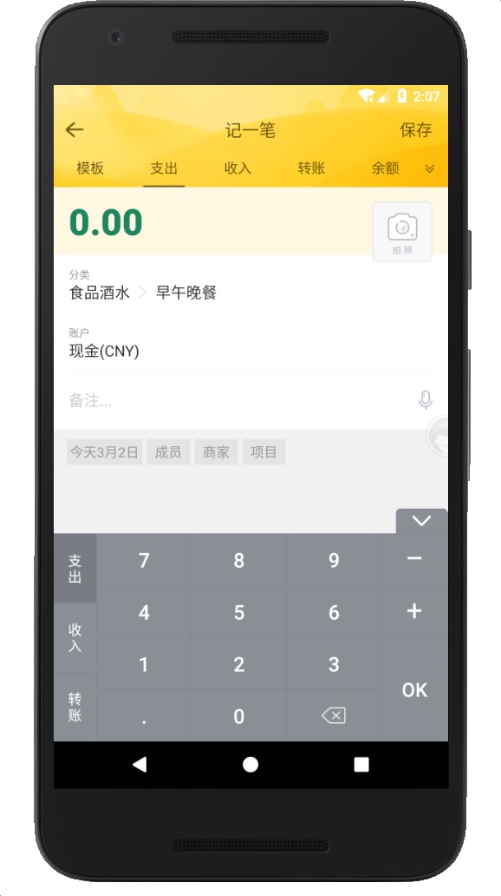
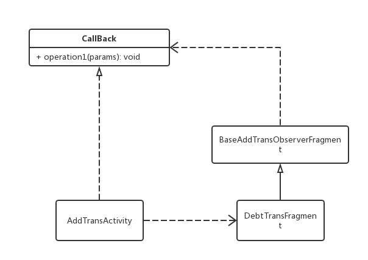
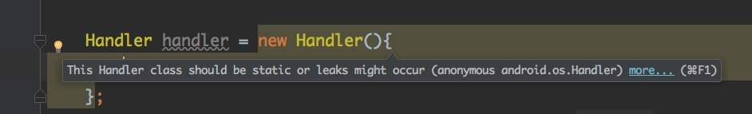
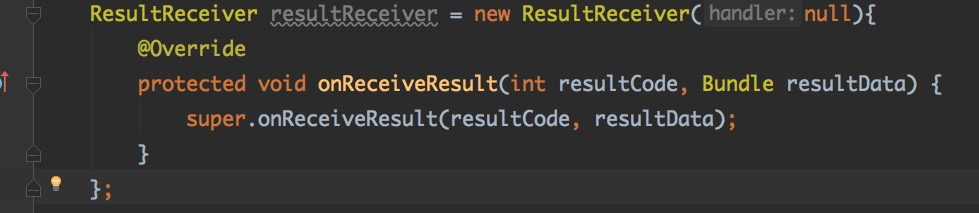

# 记一笔内存泄漏实战

```
在计算机科学中，内存泄漏指由于疏忽或错误造成程序未能释放已经不再使用的内存。
内存泄漏并非指内存在物理上的消失，而是应用程序分配某段内存后，
由于设计错误，导致在释放该段内存之前就失去了对该段内存的控制，从而造成了内存的浪费。
														摘自"维基百科"
```

智能手机发展至今,内存泄漏的问题并没有因为内存(RAM)的越来越大而得到缓解,反而更应该引起开发者的重视.<br>
因为随着手机内存的不断增大,应用运行时占用的内存也越来越大,而错误的编码导致内存泄漏也越来越大.

## 背景

记一笔是一个典型的 Activity, 里面放置一个 ViewPager, 并添加了 9 个碎片作为页面.




记一笔的每个页面都涉及到许多非常复杂的逻辑,所以页面占用的内存较高,一旦发生内存泄漏,将很快就会耗尽用户的手机内存,降低手机的流畅度,甚至引发 APP 的 OOM.

## 问题

在开发过程中,随手记使用了 [LeakCanary](https://github.com/square/leakcanary) 
作为监控内存泄漏的工具,关于它的使用以及原理,网上有许多资料和文章,这里就不展开详细介绍了.

LeakCanary 检测到内存泄漏的日志:


```java
D/LeakCanary: In ...:10.5.2.5:1052500.
* ... has leaked:
* GC ROOT android.os.ResultReceiver$MyResultReceiver.this$0
* references ....BaseAddTransObserverFragment$1.this$0 (anonymous subclass of android.os.ResultReceiver)
* references ....DebtTransFragment.mHostActivityCallBack
* leaks ....AddTransActivity instance

* Retaining: 5.5 MB.
* Reference Key: c71683bf-5064-4a47-982d-b875c374cf5f
* Device: Xiaomi Xiaomi MI MAX helium
* Android Version: 7.0 API: 24 LeakCanary: 1.5.4 74837f0
* Durations: watch=5242ms, gc=232ms, heap dump=3240ms, analysis=255349ms

```


可以看到上面内存泄漏的大小高达5M+,随着手机内存的增大,内存泄漏的危害并没有丝毫的减轻.


## 分析

LeakCanary 很好的帮助我们定位到内存泄露所在,尽管它没有指出具体的代码行,但提供的引用栈已经足够的清晰定位问题的所在,下面就这两个内存泄漏问题逐一分析.


### 问题: Activity 与 Fragment 使用 CallBack 回调进行通信, 导致内存泄漏

```
* ....AddTransActivity has leaked:
* GC ROOT android.os.ResultReceiver$MyResultReceiver.this$0
* references ...t.BaseAddTransObserverFragment$1.this$0 (anonymous subclass of android.os.ResultReceiver)
* references ....mHostActivityCallBack
* leaks ....AddTransActivity instance
```

分析日志,可以看到 BaseAddTransObserverFragment 的一个匿名内部类持有了 Activity 导致 AddTransActivity 回收异常,导致内存泄漏.<br>
它们之间的关系如下类图:




AddTransActivity 实现 CallBack 接口,并持有一个 DebtTransFragment 实例, 而 DebtTransFragment 是继承自 BaseAddTransObserverFragment 的, BaseAddTransObserverFragment 里面则持有 CallBack 的实例.<br><br>

因为 CallBack 是 AddTransActivity 实现的,所以就相当于:

```
Activity 持有 Fragment 的 实例, 而 Fragment 又持有 Activity 的实例.
```


它们的代码大概如下:<br>


### Activity 代码

```java

public class AddTransActivity extends AppCompatActivity implements DebtTransFragment.OnFragmentInteractionListener {

    @Override
    protected void onCreate(Bundle savedInstanceState) {
        super.onCreate(savedInstanceState);
        setContentView(R.layout.activity_main2);

        DebtTransFragment fragment = new DebtTransFragment();
        addFragment(fragment);

    }

    /**
     * 添加碎片
     *
     * @param fragment 碎片
     */
    private void addFragment(Fragment fragment) {
        FragmentManager fragmentManager = getSupportFragmentManager();
        FragmentTransaction transaction = fragmentManager.beginTransaction();
        transaction.add(R.id.fl_content, fragment);
        transaction.commit();
    }
}
```

### 碎片代码

```java
public class DebtTransFragment extends BaseAddTransObserverFragment {

    public interface OnFragmentInteractionListener {
        void onFragmentInteraction(String str);
    }
    
    private OnFragmentInteractionListener mListener;


    @Override
    public View onCreateView(LayoutInflater inflater, ViewGroup container,
                             Bundle savedInstanceState) {
        // Inflate the layout for this fragment
        return inflater.inflate(R.layout.fragment_blank, container, false);
    }


    @Override
    public void onAttach(Context context) {
        super.onAttach(context);
        if (context instanceof OnFragmentInteractionListener) {
            mListener = (OnFragmentInteractionListener) context;
        } else {
            throw new RuntimeException(context.toString()
                    + " must implement OnFragmentInteractionListener");
        }
    }

}

```


上面代码,实际上并不会引发内存泄漏,因为碎片的生命周期要小于 Activity,我们可以在Fragment 和 Activty 加入下面代码,观察它们的生命周期顺序:<br>

```Java

//Activty
public class Main2Activity extends AppCompatActivity implements BlankFragment.OnFragmentInteractionListener {
		//.......other code...
    @Override
    protected void onDestroy() {
        super.onDestroy();
        Log.e("activity", "onDestroy");
    }
}


//Fragment
public class BlankFragment extends BaseAddTransObserverFragment {

		//.......other code...
   
    @Override
    public void onDetach() {
        super.onDetach();
        Log.e("fragment", "onDetach");
    }


    @Override
    public void onDestroy() {
        super.onDestroy();
        Log.e("fragment", "onDestroy");
    }
}
```


然后打开 Activity, 再关闭, 日志如下:<br>

```
fragment onDestroy
fragment onDetach
activity onDestroy
```

上述日志说明 Activity 要销毁时,会先销毁碎片,这也就是意味着: 碎片销毁了持有的 Activity 引用,这样, Activity 自身销毁时,没有其他的因素继续持有它的实例,是可以正确销毁,而不会引发内存泄漏,那 LeakCanary 的内存泄漏原因是什么呢?

<b>仔细观察随手记记一笔的代码发现,记一笔,点击保存,这个时候会开启异步任务,将数据存储到数据库,而后通过 CallBack 实例回调通知保存完成.</b>


原来是异步任务持有了实例,导致生命周期不一致,从而引发内存泄漏的,找到这个原因之后,修改下面代码:

```java
//Fragment
public class BlankFragment extends BaseAddTransObserverFragment {

		//.......other code...
   
    @Override
    public void onDetach() {
        super.onDetach();
        mListener = null;
    }

}
```

取消注册碎片的时候, 将回调置空,即不再持有,异步任务会判断回调是否为 null, 只有不为null 才执行回调,这样就解决了.<br><br>

本来以为问题解决了,不想测试的时候发现原来的内存泄漏问题不再发生了,但是还有一个新的内存泄漏.<br>

### 问题: 使用 MyResultReceiver.this 匿名内部类, 导致内存泄漏

```
D/LeakCanary: In ...:10.5.2.5:1052500.
* ... has leaked:
* GC ROOT android.os.ResultReceiver$MyResultReceiver.this$0
* references ...$1.this$0 (anonymous subclass of android.os.ResultReceiver)
* references .....mContext
* leaks ....AddTransActivity instance

* Retaining: 5.0 MB.
* Reference Key: 7fb7f995-12c1-4f49-9aa9-13ee221b6758
* Device: Xiaomi Xiaomi MI MAX helium
* Android Version: 7.0 API: 24 LeakCanary: 1.5.4 74837f0
* Durations: watch=5025ms, gc=210ms, heap dump=2544ms, analysis=183730ms
```

分析日志, ViewPager 的中另外一个碎片 AddPayoutOrIncomeFragment,也是继承 BaseAddTransObserverFragment 的,他们的关系和上述一样,就不再重复画图.<br>
日志分析碎片持有了 Activity 引用导致内存泄漏,而根据之前的分析,这并不会导致内存泄漏,那会不会是什么异步任务呢?<br>
仔细分析了代码,并没有发现异步任务,再回到日志,发现 ResultReceiver.MyResultReceiver 的一个匿名内部类持有了 Activity 的引用导致的.


### ResultReceiver 是啥?

查看 ResultReceiver 源码, 发现它其实就是一个封装了 Handler 的类,用于消息回调,类的开头描述强调了,这个是一个简单的进程间通信(IPC),但它不会影响生命周期的管理,也就意味着我们需要自己管理它. 说白了就是它和 Activity的生命周期是不同的,不会随着 Activity 的销毁而销毁.


```java
/**
 * Generic interface for receiving a callback result from someone.  Use this
 * by creating a subclass and implement {@link #onReceiveResult}, which you can
 * then pass to others and send through IPC, and receive results they
 * supply with {@link #send}.
 *
 * <p>Note: the implementation underneath is just a simple wrapper around
 * a {@link Binder} that is used to perform the communication.  This means
 * semantically you should treat it as such: this class does not impact process
 * lifecycle management (you must be using some higher-level component to tell
 * the system that your process needs to continue running), the connection will
 * break if your process goes away for any reason, etc.</p>
 */
public class ResultReceiver implements Parcelable {
    final boolean mLocal;
    final Handler mHandler;
    
    IResultReceiver mReceiver;
 
```


这个特点和 Handler 很像,而且我们都知道,如果 Handler 作为一个匿名内部类,写在 Activity 中,就会引发内存泄漏,因为生命周期不一致,而匿名内部类又持有了 Activity 的引用,导致无法正常回收 Activity.关于Handler 的问题网上有很多文章研究,这里就不再展开说明.<br>





稍微高版本的 Android IDE, 在你创建一个匿名的 Handler 时,都会提示这么做会造成内存泄漏,其实 ResultReceiver 同样也会如此,但这个类比较少人使用,IDE 没有给出提示.




而记一笔中碎片中,为了监听输入法的回调,使用了这个 ResultReceiver,并创建了一个匿名的内部类,从而导致了内存泄漏:

```java
        mMemoEtInputMethodResultReceiver = new ResultReceiver(null) {

            @Override
            protected void onReceiveResult(int resultCode, Bundle resultData) {
                super.onReceiveResult(resultCode, resultData);
                switch (resultCode) {
                    case InputMethodManager.RESULT_SHOWN:
                        if (mTabAddBtn != null) {
                            mTabOkBtn.performClick();
                        }
                        break;
                    //键盘关闭事件
                    case InputMethodManager.RESULT_HIDDEN:
                        break;

                    default:
                        break;
                }
            }
        };

```

解决方法:<br>

1. 使用 Stack Overflow 中推荐的[写法](https://stackoverflow.com/questions/4510974/using-resultreceiver-in-android/4549639)

2. 在碎片销毁的时候主动销毁它,即让 ResultReceiver 的生命周期跟随 碎片的生命的周期,这样就可以做到不会超过碎片的生命周期,防止了内存泄漏.

```java
    @Override
    public void onDetach() {
        super.onDetach();
        mHostActivityCallBack = null;
        mMemoEtInputMethodResultReceiver = null;
    }
```


## 回测

修改了多次反复操作记一笔之后,没有发现内存泄漏的日志和提示,分析内存数据，也没有发现泄漏的问题。至此, 问题得到了解决.


## 总结

内存泄漏主要是一些不可达的对象仍然占用这内存,无法释放.表现为一个对象要被销毁,而因为另一个对象持有而不能正常的回收,这两个对象又不再可达.<br>
在 Android 中的表现通常是一个对象持有 UI, 而 UI 生命周期完结时,对象还持有 UI 的引用而导致内存泄漏.<br>
内存泄漏这个问题虽然一直在强调,但仍然不免会写出一些问题代码,只要谨记生命周期是否一致,是否需要主动注销,关闭或销毁,就可以避免95%的内存泄漏问题.