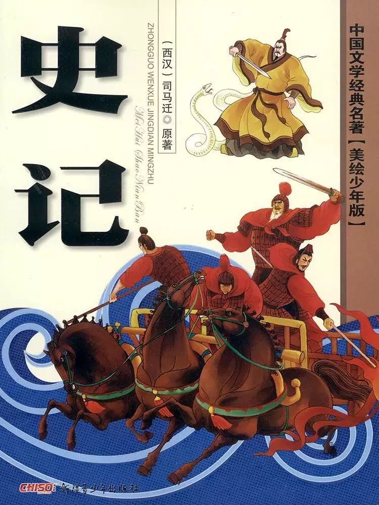
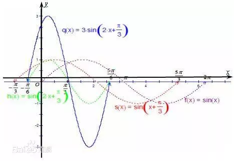
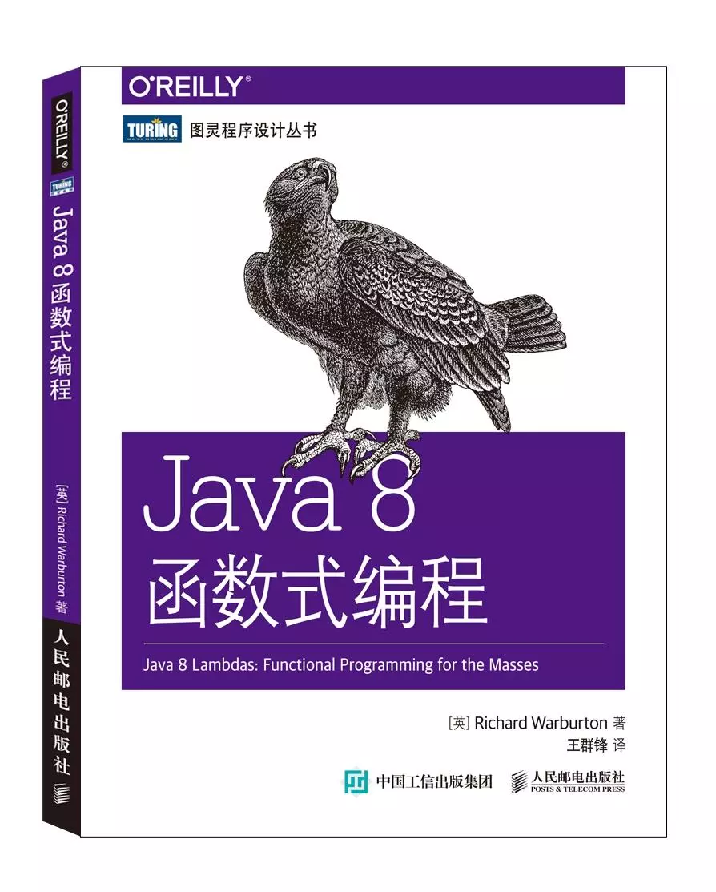
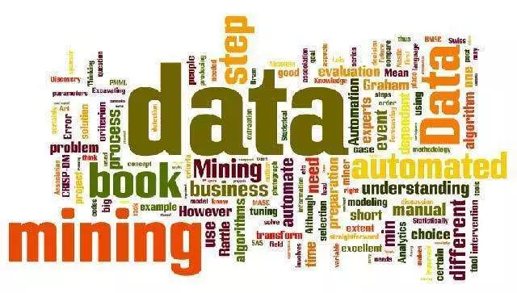
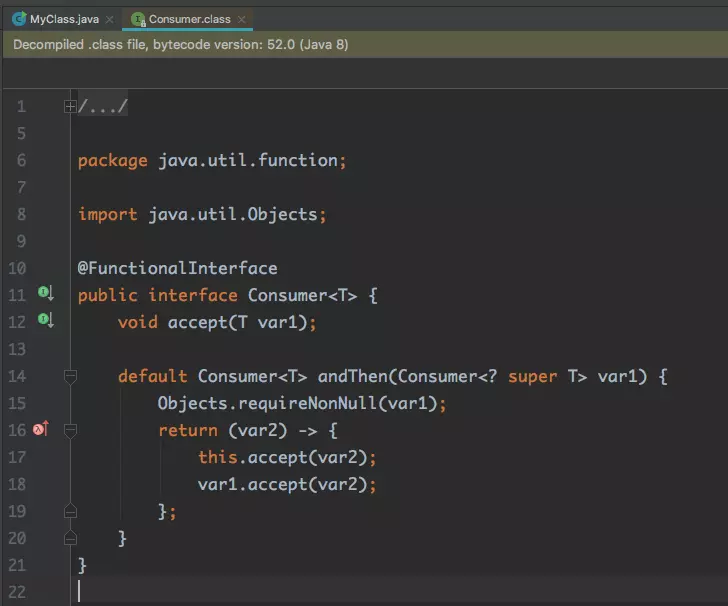

# Java 8 函数式编程

本次主题主要介绍什么是函数式编程,其主要特点, 以及它在 Java8 中是怎么体现的.<br><br>
函数式编程这个思维早在1958年就被提出来的了,在60年后的今天重新被提出来,且越来越流行,其主要原因是 CPU 的时钟频率发展停滞不前,目前徘徊在4GHZ左右。<br>
CPU 的时钟频率越快,则运行速度越快,但目前的工艺技术限制了 CPU 频率的进一步提升,主流的芯片厂商目前都转向了多核处理器这个架构方向,所以我们编程不能再依赖时钟频率提高现有代码的计算能力,需要充分利用现在 CPU 架构,而这唯一的办法就是编写并行化的代码.<br><br>

```
“学习一种全新的编程范式，困难并不在于掌握新的语言。
毕竟能拿起这本书的读者，学过的编程语言少说也有一箩筐——语法不过是些小细节罢了。
真正考验人的，是怎么学会用另一种方式去思考 。”

摘录来自: [美] 福特（Neal Ford）. “函数式编程思维 (图灵程序设计丛书)”。 
```

函数式编程思想,可以编写出简洁,高效的并行代码,这也就是为什么现在又将函数式编程思维提出来,且越来越成为一种趋势的原因.<br><br>

## 什么是函数式编程?

计算机编程语言的分类：

### 机器语言
### 汇编语言
### 高级语言

| 转换方式 | 客观描述 | 编程范型 |
| -------- | -------- | -------- |
| 编译型   | 面向过程 | 命令式   |
| 解释型   | 面向对象 | 函数式   |

#### 转换方式

编译型,即事先将程序翻译成了 CPU 指令,只能运行在特地的环境里(CPU, 架构等,例如 C)<br>
解释性,即边解析程序边翻译成 CPU 指令,一般和平台无关(例如 Java).<br>

说通俗点, 编译型语言即把东西煮熟了,可以直接开吃,而解释型语言是火锅,要边煮边吃.<br>
所以编译型语言吃的快,解释性语言吃的慢.<br>


Java 虽然会将代码编程成 class 文件,但 class 文件本质上是字节码,并不是 CPU 指令,所以不是编译型语言.<br>

#### 客观描述

说面向过程和面向对象,我们先来说说写史书的两种方式:编年体和纪传体.<br><br>
编年体是按照时间来写，比如说某一年发生了什么大事、谁谁干了什么，第二年又有什么大事、谁谁干了什么，这么写。<br>
纪传体就是为某人立传的形式来写。以一个人为主线。比如说，某某，生于多少年，哪一年干了什么，哪一年又干了些什么，一直写下去。而且并不一定严格按照时间为顺序,写书的人可能会采用倒叙等方式叙述.<br><br>





而编年体和纪传体就是对应着面向过程和面向对象,面向过程注重的是步骤,而面向对象则以对象为主,着重于解决问题的思路<br>

#### 编程范式

命令式编程是面向计算机硬件的抽象，有变量（对应着存储单元），赋值语句（获取，存储指令），表达式（内存引用和算术运算）和控制语句（跳转指令），一句话，命令式程序就是一个冯诺依曼机的指令序列。 <br>
而函数式编程是面向数学的抽象，将计算描述为一种表达式求值，一句话，函数式程序就是一个表达式。 <br>

这里只要的区别是在写代码的过程的思维,而不是编译后的结果.<br>
可能一个函数式语言,经过编译后最后成了一条条 CPU 指令,但是并不能说明这个语言不是函数式语言. <br>

## 函数式编程

以 Java 为例:<br>

```java
String getName(){
	return name;
}
```

<br>上述代码, getName 我们通常称之为 "方法", 也可以称之为 "函数".<br>

### 方法与函数到底有什么区别呢?

两个称呼不同其实编程范式思想.<br> 方法,即注重解决问题的步骤,过程. 函数,则注重类型之间的代数关系<br><br>
这里所说的函数,指的是数学上的函数.<br>
让我们先回顾一下中学数学,函数是怎么定义的:<br><br>



函数的定义：给定一个数集A，假设其中的元素为x。现对A中的元素x施加对应法则f，记作f（x），得到另一数集B。假设B中的元素为y。则y与x之间的等量关系可以用y=f（x）表示。我们把这个关系式就叫函数关系式，简称函数。函数概念含有三个要素：定义域A、值域C和对应法则f。其中核心是对应法则f，它是函数关系的本质特征。<br><br>


其中这个法则 f, 在函数式编程中就称之为 <b>函数</b>,所谓的函数式编程,即编写代码的时候,注重的是类型之间的代数关系 fun.<br><br>

举个例子:<br>
在学习编程的时候,有一个流传了很广的🌰→ 交换 A,B 两数<br><br>

```java
//方法思想
void change(int a,int b){
	int c = a;
	a = b;
	b = c;
	System.out.println("a: " + a + "   b:" + b); 
}
```

```java
//函数思想
void change(int a,int b){
	System.out.println("a: " + b + "   b:" + a);
}
```


这本来是我上编程课,老师讲的一个笑话,说有一个学生偷懒,直接将 a,b 交换输出了.<br> 当时觉得那个人真是脑洞大开,而写代码应该追求简单明了,这种偷懒,其实也应该得到鼓励和支持.<br><br>


交换A,B 两数,从本质上来讲,是阐述了 A,B 两数与结果之间是一个互换的行为,而具体怎么交换,应该有什么步骤, 不同的语言和平台有不同的方法, 但最终描述的都是这样的一个本质.

而函数式编程,其实就是追求一种<b>"简单的,高效的,类型之间的关系"</b>.<br>
这样的思想更加符合我们人的思维,更加的抽象.<br>

定义:
```
函数式编程,实际上是一种编程范式,区别于命令式注重解决问题的步骤,函数式注重的数据之间的关系 --- 即 f(x).
```

从上面的介绍可知,函数式编程实际上是在写代码的时候的一种编程思想,无关编译后具体是怎么处理和执行的,例如现在非常火的 Kotlin, 作为一种函数式编程语言,可以将它编译成 class 字节码,从编译后的字节码来看,和 Java8 之前的编译出来的代码并没有本质的区别.<br><br>


## 函数式编程的特点

1. 代码简洁，开发快速

  函数式编程将大量重复的的通用操作写成函数，减少了代码的重复，因此代码少, 开发速度快, 而 Kotlin 之所以比 Java 更简洁, 这也是其中一个重要的原因.

2. 更接近自然语言(人类的语言)，易于理解

  前面的例子,已经说明,函数式编程的思维更接近人类的思维,所以更易被我们理解.<br>下面会用 Java8 举例说明

3. 更方便的代码管理,易于"并发编程"

  函数式编程更为抽象, 更通用的抽象函数能更加解耦, 模块化管理更加方便.<br>
  无论是 Java 亦或是其他语言,在并发这块,代码编写和管理都是一个难点.<br>
  函数式编程不依赖、也不会改变外界的状态，只要给定输入参数，返回的结果必定相同。因此，每一个函数都可以被看做独立单元，也不用担心死锁,同步,以及内存可见等各种头疼的多线程问题,这将非常有利于进行单元测试和除错，以及模块化,解耦等等。


## Java8的函数式编程





### Lambda 表达式

Lambda, 数学符号为 λ, 我们上学时候经常使用的符号还有alpha--α, beta--β 等等, 使用 λ 作为函数式编程的符号,是因为 <b>[λ演算](https://zh.wikipedia.org/wiki/%CE%9B%E6%BC%94%E7%AE%97)</b>:<br><br>
[从理论上说，函数式语言也不是通过冯诺伊曼体系结构的机器上运行的，而是通过λ演算来运行的，就是通过变量替换的方式进行，变量替换为其值或表达式，函数也替换为其表达式，并根据运算符进行计算。λ演算是图灵完全（Turing completeness）的，但是大多数情况，函数式程序还是被编译成（冯诺依曼机的）机器语言的指令执行的。](https://www.zhihu.com/question/28292740/answer/237635431)<br><br>


通俗来说,函数式思想的本质是 λ演算,但这个思想具体到了编程,还是使用机器语言去执行的,所以和纯粹的函数式思想有一点点区别,而不同的函数式编程语言,在具体的实现上也不尽相同.<br><br>





Java8 中的 Lambda 表达式 表现为高阶函数,即将函数作为参数传入.下面来认识一下 Java8 中的 Lambda 表达式:<br>

```java
//0, lambda 表达式的右边是一个闭包,应该使用{}括起来,这是 lambda 表达式最完整的表达
Consumer<String> consumer3 = (String it) -> {
    System.out.println(it);
};


//1, 0 个参数, run() 方法演变成 lambda 表达式
Runnable runnable = () -> System.out.println("123");


//2, 1个参数,传如 it,假设这个类型可以推断出来,则可以省略
Consumer<String> consumer = it -> System.out.println(it);


//3, 指出了 it 的具体类型为 String
Consumer<String> consumer2 = (String it) -> System.out.println(i);


//4, 多条语言,不能省略右边的大括号
Consumer<String> consumer4 = (String it) -> {//省略大括号编译不能通过
    System.out.println(it);
    System.out.println("other code: " + it);
    //other code
    //
};


//5, 多参数
BinaryOperator<String> operator = (x, y) -> {
    return x + y;
};


//6:方法引用, 0,2,3都可以转为方法引用, 1不行因为输出了字符串 "123", 4是因为有多条语句
Consumer<String> consumer5 = System.out::println;
Consumer<String> consumer6 = Person::getName;
Consumer<String> consumer7 = Person::new;                                           
```


### 类库

认识了 Lambda 表达式之后,我们来使用它,举个🌰<br>
Java 编程中,经常使用 CallBack 来进行回调,通常代码如下:<br>

```java
public static class Person {
    private NameChangeListener listener;
    public void setListener(NameChangeListener listener) {
        this.listener = listener;
    }
    public static interface NameChangeListener {
        void change(String name);
    }
}
public static class God {
    private NameChangeListener listener;
    public void setListener(NameChangeListener listener) {
        this.listener = listener;
    }
    public static interface NameChangeListener {
        void change(String name);
    }
}

public static void main(String[] args) {
    Person person = new Person();
    person.setListener(new Person.NameChangeListener() {
        @Override
        public void change(String name) {
            System.out.print("new name: " + name);
        }
    });
    God god = new God();
    god.setListener(new God.NameChangeListener() {
        @Override
        public void change(String name) {
            System.out.print("new name: " + name);
        }
    });
}
```


上面两个类, Person 和 God 都有一个回调,且回调的签名是一模一样的,但是不能将 God 的回调实例传递给 Person:<br>

```java
 Person person = new Person();
    person.setListener(new God.NameChangeListener() {//报错,编译无法通过
        @Override
        public void change(String name) {
            System.out.print("new name: " + name);
        }
    });

```

尽管两个回调的签名一模一样的,但是假设这两个类是来自不同的类库, Person 是无法访问到 God 中的回调接口,也就无法使用 God 中的回调替换, 故无法编译通过.<br>
现在将这两个回调统一,抽取出相同的签名,如下:<br>

```java
interface NameChangeListener {
    void change(String name);
}

//更为通用的,假设参数不是一个 String, 而是任意的类型,使用泛型可以这么写
interface Consumer<T> {
    void change(T var);
}
```

上面的 Consumer 这个接口, 只有一个方法,接受一个 T, 返回一个 void, 假设我们能告诉编译器,任何符合这样签名的,都可以替换掉,那岂不是美滋滋?<br><br>


<b>Lambda 本质上就是将一个通用的函数接口替换掉和它签名一模一样的其他类或接口</b><br><br>

使用 Lambda 替换 Person 的匿名内部类:<br>

```java
Person person = new Person();
person.setListener(name -> System.out.print("new name: " + name));
```

根据之前的 lambda 表达式的介绍,上面这段表达式的是意思是,传入一个参数,这个参数,从类型推断上来讲,它是 String 类型, 且执行了一条打印语言,并且没有返回值.
这个函数从签名上来讲,和 Person.NameChangeListener 一模一样,故在 Java8中允许使用这个 lambda 表达式替换掉前面的匿名内部类.<br><br>

上面这个表达式,其本质上是使用 Java8自带的一个函数接口,称之为类库,我们看一下它的源码:<br>




可以看到,这个函数接口, Consumer 和我们上面抽象出来的函数接口一样,多了一个默认方法而已,这个默认方法是 java8 接口新增的一个特性,是为了兼容旧接口且保持向后兼容（backward compatibility）提供了途径.<br><br>

这里最重要的不是默认方法,而是那个 <b>@FunctionalInterface</b> 注解,表示这个接口是一个函数接口,可以使用 lambda 表达式,关于这样的函数接口还有很多,都在<br>

```
package java.util.function;
```

这个包下面.其实我们在接触 RxJava 的时候,就已经学到使用到了这些函数接口,常用的函数接口非常多,以至于几乎无法一一记住.<br>
但一般无需刻意去记住这些函数接口,我们在使用 lambda 表达式的时候无需刻意去想需要使用哪个函数接口,编译器会自动匹配. 只有我们在阅读类库,或者设计类库的时候,可能需要去理解和使用到这些函数接口.


### 流

如果是 Java8 中的 lambda 表达式"仅仅"是一种"语法糖",而 Stream 的出现则是 Java 8 的最大亮点.<br>
它与 java.io 包里的 InputStream 和 OutputStream 是完全不同的概念。它也不同于 StAX 对 XML 解析的 Stream. <br><br>
Java 8 中的 Stream 是对集合（Collection）对象功能的增强，它专注于对集合对象进行各种非常便利、高效的聚合操作（aggregate operation），或者大批量数据操作 (bulk data operation)。Stream API 借助于同样新出现的 Lambda 表达式，极大的提高编程效率和程序可读性。同时它提供串行和并行两种模式进行汇聚操作，并发模式能够充分利用多核处理器的优势，使用 fork/join 并行方式来拆分任务和加速处理过程。通常编写并行代码很难而且容易出错, 但使用 Stream API 无需编写一行多线程的代码，就可以很方便地写出高性能的并发程序。所以说，Java 8 中首次出现的 java.util.stream 是一个函数式语言+多核时代综合影响的产物。<br><br>


<br><br>集合都实现了 Collection 接口,在 java8 以后,加上了一个 stream() 的默认方法, 用于使用 流 功能,举个🍐,计算集合中的所有大于5的数字的个数:<br>

```java
    /**
     * 计算大于5的个数
     */
    public static long addUp(List<Integer> data) {
        long count = 0;
        for (int i = 0; i < data.size(); i++) {
            if (data.get(i) > 5) {
                count++;
            }
        }
        return count;
    }

    /**
     * 计算大于5的个数
     */
    public static long addUp8(List<Integer> data) {
        return data.stream().filter(it -> it > 5).count();
    }


```

首先会看我们的问题: 计算集合中的所有大于5的数字的个数<br><br>
按照数学思维,我们应该先将所有大于5的数字找出来,然后算一共有几个.<br><br>
再看上述流的例子,首先 data 通过 stream() 获得到了集合的流,然后通过 filter() 方法筛选出了大于5的数字(其中筛选代码使用了 lambda 表达式 表达),最后通过 count() 方法计数.<br>
根据函数式编程的思想,流符合对简洁的要求,符合人的思维.<br><br>


Stream 接口中定义了很多 filter, count 等方法, 这些方法的参数都是前文中所提到到 <b>函数式接口</b> 风格. 这些方法可以按照两个种类来区分: 惰性求值和及时求值.<br><br>

上文中, 假设将流的代码改为下面的例子:<br>

```java
    /**
     * 计算大于5的个数
     */
    public static long addUp8(List<Integer> data) {
        Stream<Integer> stream = data.stream().filter(it -> {
            System.out.println("456");
            return it > 5;
        });
        System.out.println("123");

        return stream.count();
    }

    public static void main(String[] args) {
        List<Integer> data = new ArrayList<>();
        for (int i = 0; i < 100; i++) {
            data.add(i);
        }
        addUp8(data);
    }
```

结果:<br>

```
123
456
456
.......
```

从结果中可以看到, 456的代码尽管是在 123的之前,但是因为 filter() 属于惰性求值,只有真正的执行到它的时候它才会运行.<br><br>

<b>区分 Stream 接中的方法是及时求值,还是惰性求值,只要看它的返回值,如果不是一个 Stream, 那就是及时求值.</b><br><br>


对 RxJava 比较熟悉的同学就会发现了, 流和 RxJava 很像,实际上他们的操作符基本上都是一样的,编程思想也是类似,都可以定义为一种函数式编程.<br>
Stream 是为构建内存中集合的计算流程而设计的,而 RxJava 则是为了组合异步和基于事件的系统流程而设计的. Stream 没有取数据,而是把数据放进去, Stream 是为了计算最终的结果,而 RxJava 在线程模型上则像是 CompletableFuture, 为了得到一个响应的结果,故RxJava 也叫响应式编程.<br><br>


#### 数据并行化

上文流的例子,很好的体现了函数式编程中的简洁,接近人的思维,现在介绍易于编写并发这块,下文集合串行并行对比:<br>

```java
    public static void main(String[] args) {
        List<Integer> integerList = new ArrayList<>();
        for (int i = 0; i < 20; i++) {
            integerList.add(i);
        }
        
        //串行
        long b = System.currentTimeMillis();
        System.out.println("start...");
        long a = integerList.stream().map(it -> {
            try {
                TimeUnit.MILLISECONDS.sleep(300);
            } catch (InterruptedException e) {
                e.printStackTrace();
            }
            return it + 1;
        }).count();
        System.out.println("end: " + (System.currentTimeMillis() - b));


			//并行,关键字: parallelStream()
        long c = System.currentTimeMillis();
        System.out.println("\n\n");
        System.out.println("start...");
        long d = integerList.parallelStream().map(it -> {
            try {
                TimeUnit.MILLISECONDS.sleep(300);
            } catch (InterruptedException e) {
                e.printStackTrace();
            }
            return it + 1;
        }).count();
        System.out.println("end: " + (System.currentTimeMillis() - c));
    }
```

结果:<br>

```
start...
end: 6124


start...
end: 1513
```


就这么简单, Java8 的流使用 parallelStream()方法能很方便的进行并行操作,其本质上是使用Fork/Join框架实现的(详情[可见](http://lvheyang.com/?p=87)), 这个框架自 Java7 引入,能将一个大任务切割成若干个小任务并行执行<br>


Java8 数组也有并行化操作,例如我们经常使用的数组初始化:<br>

```java
public static void main(String[] args) {
    long a = System.currentTimeMillis();
    System.out.print("\n\nstart...");
    String[] strings = new String[20];
    for (int i = 0; i < strings.length; i++) {
        try {
            TimeUnit.MILLISECONDS.sleep(300);
        } catch (InterruptedException e) {
            e.printStackTrace();
        }
        strings[i] = i + "";
    }
    System.out.print("end: " + (System.currentTimeMillis() - a));
    long b = System.currentTimeMillis();
    System.out.print("\n\nstart...");
    String[] strings2 = new String[20];
    Arrays.parallelSetAll(strings2, i -> {
        try {
            TimeUnit.MILLISECONDS.sleep(300);
        } catch (InterruptedException e) {
            e.printStackTrace();
        }
        return i + "";
    });
    System.out.print("end: " + (System.currentTimeMillis() - b));
}
```

结果:<br>

```
start...end: 6059

start...end: 1562
```


### 使用 Java8 函数式编程注意事项

Java 作为一门语言,在很多方面都经过了时间的考验.问题在于,这么多年来, Java 并没有紧跟时代向前演进, 落了一个保守的名声,而 Java8的出现则是一个积极的型号,相对于6,7而言,它正在大步前进,同时它的改进也遇到了一些问题.

#### lambda 表达式可引用外部变量

根据之前对函数式思想的介绍, 函数式是不修改外部变量,这样更有利于它的编程和测试,更纯粹和简洁,但Java8 中, lambda 表达式还是可以引用外部变量:<br>

```java
    //全局变量
    String a;

    public void testLambda() {
        Consumer<String> consumer = it -> {
            a = it;
        };
    }

    public void testLambda2() {
        String b = "123";
        Consumer<String> consumer = it -> {
            System.out.println(b);
        };
        //如果修改 b 则无法编译通过
//        b = "456";
    }
```

可以看到 lambda 表达是仍然可以引用全局变量,这对函数式思想来说,不是一个好习惯,所以我们在编写代码的时候要避免使用这种情况.<br>
在局部变量的时候,要求这个变量必须是final,或是一个既定的 final 值,即没有地方会修改到它.<br>
上面例子中,假设不注释掉 b = "456", 则编译无法通过, 因为 Java8的设计是函数式编程,lambda 是f(X)函数关系,它是对值求关系,不是对变量求关系,假设变量是final,或是一个既定的 final 值,则 表达式引用的是一个值,不是具体的某个变量.<br><br>

#### 并发编程并不总是最优的,避免并发陷阱

```
这两个并行的例子都使用了线程等待,模拟了一些耗时操作的情形
实际上假设去掉等待时间, 并行的速度未必会快于串行,这取决于硬件环境和任务本身等多重因素
```

以上面的为例,假设去掉了等待,在我的电脑上执行结果为:

```java
    public static void main(String[] args) {

        long a = System.currentTimeMillis();
        System.out.print("\n\nstart...");
        String[] strings = new String[20];
        for (int i = 0; i < strings.length; i++) {
//            try {
//                TimeUnit.MILLISECONDS.sleep(300);
//            } catch (InterruptedException e) {
//                e.printStackTrace();
//            }
            strings[i] = i + "";
        }
        System.out.print("end: " + (System.currentTimeMillis() - a));


        long b = System.currentTimeMillis();
        System.out.print("\n\nstart...");
        String[] strings2 = new String[20];
        Arrays.parallelSetAll(strings2, i -> {
//            try {
//                TimeUnit.MILLISECONDS.sleep(300);
//            } catch (InterruptedException e) {
//                e.printStackTrace();
//            }
            return i + "";
        });
        System.out.print("end: " + (System.currentTimeMillis() - b));


    }
```

结果:<br>


```
start...end: 0

start...end: 66
```


可以看到初始化一个20长度的数组,在串行里几乎不耗费任何时间,反而并行因为需要上下文切换和任务调度,消耗了一定的时间.<br><br>
<b>并行虽好用,也要根据情况正确的使用.</b>


## 总结

本次主题主要介绍什么是函数式编程,其主要特点, 以及它在 Java8 中是怎么体现的.

计算机发展至今不到百年,如今更掀起一次又一次的技术革命,而作为与机器打交道的编程语言更是层出不穷, 作为个体程序员很难一一去学习它们, 我们更应该去思考编程语言的设计思想. <br>
引用开头摘自书中的一段话:

```
学习一种全新的语言,困难不在数据类型,控制语句,或数据结构----语法不过是些小细节罢了。
真正应该学习的是:怎么学会用另一种方式去思考,去学习语言的设计思想.
```

函数式编程是一种编程范式,区别于命令式注重解决问题的步骤,函数式注重的数据之间的关系 --- 即 f(x). <br>它不是某一个语言或者某一种语言特有的,如我们熟悉的 RxJava 就包含了函数式编程思想,所以 RxJava 也叫函数式响应式编程. 而比较火的 Kotlin, 也可以是面向对象的,也可以是函数式编程风格的.<br>
语言本身只是函数式思想的具体表达,而我们更应该转换的是编写代码时的思考方式.

## 参考资料

[什么是函数式编程思维？ - 知乎](https://www.zhihu.com/question/28292740)

[Java 8 中的 Streams API 详解 -  IBM](https://www.ibm.com/developerworks/cn/java/j-lo-java8streamapi/)

[Java 8函数式编程](https://book.douban.com/subject/26346017/)

[函数式编程思维](https://book.douban.com/subject/26587213/)